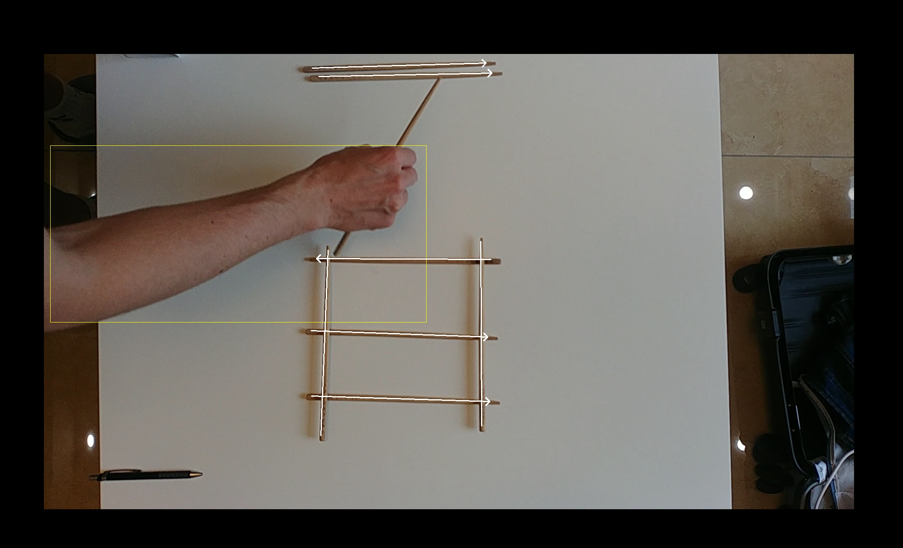

# Chopstick Tracker

## Summary
1. [Introduction](#introduction)
2. [Compilation](#compilation)
3. [Usage](#usage)
4. DNN model training
5. Running this application in the cloud
6. Thanks
7. License

## Introduction
I have developed this project in order to learn how to use a
[deep neural network](https://en.wikipedia.org/wiki/Deep_learning) to detect and track objects in
a video. For that I have chosen the [YOLO v3](https://pjreddie.com/darknet/yolo/) model, because it has
good results, can work in real-time and is easy to use.

This application is able to detect and track [chopsticks](https://en.wikipedia.org/wiki/Chopsticks).
The idea is to combine it later with a [robotic arm](https://en.wikipedia.org/wiki/Robotic_arm) that
will automatically recognize where chopsticks are located, and then move them to a specific
position according a user-defined pattern (for example like a grid). The robotic arm would also be able
to detect when somebody "breaks" the pattern and fix it automatically.

You can see the resulting video by clicking on the following image:
[](https://youtu.be/d3EM2Zqqtio)

## Compilation
```bash
# Boost compilation and installation
mkdir -p ~/projects
cd ~/projects
wget https://dl.bintray.com/boostorg/release/1.70.0/source/boost_1_70_0.tar.gz
tar -xzf boost_1_70_0.tar.gz
rm -f boost_1_70_0.tar.gz
cd boost_1_70_0

./bootstrap.sh --prefix=/usr/local/
./b2
./b2 headers
sudo ./b2 install

# RapidJSON compilation and installation
cd ~/projects
git clone https://github.com/Tencent/rapidjson.git
cd rapidjson
mkdir -p build
cd build
cmake -D CMAKE_BUILD_TYPE=RELEASE \
    -D CMAKE_INSTALL_PREFIX=/usr/local \
    -D RAPIDJSON_BUILD_DOC=OFF \
    -D RAPIDJSON_BUILD_EXAMPLES=OFF \
    -D RAPIDJSON_BUILD_TESTS=OFF \
    -D RAPIDJSON_BUILD_THIRDPARTY_GTEST=OFF \
    -D RAPIDJSON_BUILD_CXX11=ON \
    ..
make
sudo make install

# FFMpeg compilation and installation
brew install automake fdk-aac git lame libass libtool libvorbis libvpx \
    opus sdl shtool texi2html theora wget x264 x265 xvid nasm pkg-config

cd ~/projects
git clone https://git.ffmpeg.org/ffmpeg.git
cd ffmpeg

./configure \
    --cc=/usr/bin/clang --prefix=/usr/local \
    --enable-gpl --enable-version3 \
    --enable-shared \
    --disable-programs --disable-doc \
    --enable-libx264

make -j4
sudo make install

# OpenCV compilation and installation
brew install cmake pkg-config jpeg libpng libtiff openexr eigen tbb wget

cd ~/projects
git clone -b 4.1.0 --single-branch https://github.com/opencv/opencv.git
git clone -b 4.1.0 --single-branch https://github.com/opencv/opencv_contrib.git

cd opencv
mkdir -p build
cd build
cmake -D CMAKE_BUILD_TYPE=RELEASE \
    -D CMAKE_INSTALL_PREFIX=/usr/local \
    -D OPENCV_EXTRA_MODULES_PATH=~/projects/opencv_contrib/modules \
    -D BUILD_opencv_python2=OFF \
    -D BUILD_opencv_python3=OFF \
    -D INSTALL_PYTHON_EXAMPLES=OFF \
    -D INSTALL_C_EXAMPLES=OFF \
    -D OPENCV_ENABLE_NONFREE=OFF \
    -D WITH_FFMPEG=1 \
    -D BUILD_opencv_dnn=ON \
    -D BUILD_EXAMPLES=OFF ..
make -j4
sudo make install

# Darknet compilation and installation
cd ~/projects
git clone https://github.com/AlexeyAB/darknet.git
cd darknet

mkdir -p build
cd build
cmake -D CMAKE_BUILD_TYPE=RELEASE \
    -D CMAKE_INSTALL_PREFIX=/usr/local \
    -D ENABLE_OPENCV=FALSE \
    -D ENABLE_CUDA=FALSE \
    ..
make -j4
sudo make install
sudo cp libdark.dylib /usr/local/lib/

# Project compilation
cd ~/projects
cd chopsticks-tracker

mkdir -p build
cd build
cmake -G "Unix Makefiles" ..
make
```

## Usage
```bash
cd ~/projects/chopsticks-tracker/build
./ChopsticksTracker --config-path=../config.ini --video-path=../data/input-video/VID_20181231_133114.mp4
```
