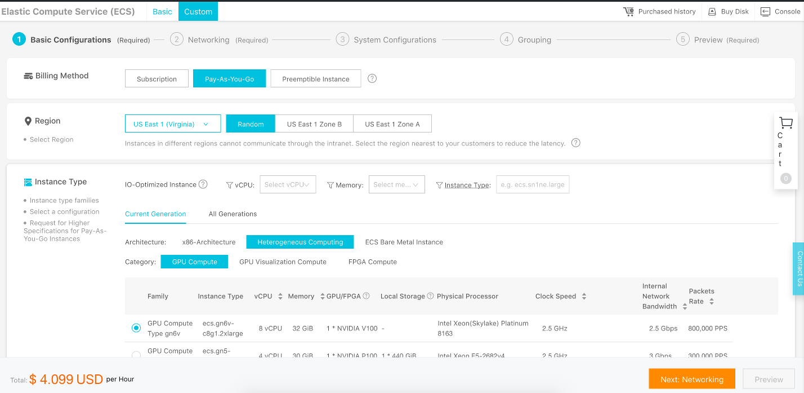

# Chopstick Tracker

## Summary
1. [Introduction](#introduction)
2. [Compilation](#compilation)
3. [Usage](#usage)
4. [DNN model training](#dnn_model_training)
5. [Cloud deployment](#cloud_deployment)
6. [External links](#external_links)

## Introduction
The goal of this project is to help me to learn about how to use a
[deep neural network](https://en.wikipedia.org/wiki/Deep_learning) to detect and track objects in
a video. For that I have chosen the [YOLO v3](https://pjreddie.com/darknet/yolo/) model, because it has
good performance, can work in real-time and is easy to use.

This application is able to detect and track [chopsticks](https://en.wikipedia.org/wiki/Chopsticks).
The idea is to combine it later with a [robotic arm](https://en.wikipedia.org/wiki/Robotic_arm) that
will automatically recognize where chopsticks are located, and then move them to a specific
position according a user-defined pattern (for example a grid). The robotic arm would also be able
to detect when somebody "breaks" the pattern, so it can fix it automatically.

You can see the resulting video by clicking on the following image:
[](https://youtu.be/d3EM2Zqqtio)

## Compilation
The following instructions describes how to compile this project and its dependencies on MacOS Mojave
and Ubuntu Linux 18.04 64-bit.

Before stating, make sure your system respects the following prerequisites:
* If you use MacOS, make sure you have installed the
  [Xcode Command Line Tools](https://apple.stackexchange.com/questions/337744/installing-xcode-command-line-tools/33901),
  [Homebrew](https://brew.sh/) and [cmake](https://formulae.brew.sh/formula/cmake).
* If you use Ubuntu, please make sure you have installed the
  [binutils](https://packages.ubuntu.com/bionic/binutils),
  [git](https://packages.ubuntu.com/bionic/git) and
  [cmake](https://packages.ubuntu.com/bionic/cmake) packages.
* If your machine has a CUDA-compatible GPU, make sure you have installed the
  [CUDA Toolkit 10.1](https://developer.nvidia.com/cuda-toolkit).
* In order to checkout this project with git, you need to install
  [git-lfs](https://github.com/git-lfs/git-lfs/wiki/Installation). This allows you to download
  big files such as [data/input-video/VID_20181231_133114.mp4](data/input-video/VID_20181231_133114.mp4)
  or [data/yolo-model/yolov3.weights](data/yolo-model/yolov3.weights).

The first step is to install the dependencies for this project. Open a terminal to your machine and
execute the following commands:
```bash
# Run the following command if you use MacOS
NB_PROCESSORS=$(sysctl -n hw.ncpu)

# Run the following command if you use Ubuntu Linux
NB_PROCESSORS=$(nproc)

#
# Boost compilation and installation
#
mkdir -p ~/projects
cd ~/projects
wget https://dl.bintray.com/boostorg/release/1.70.0/source/boost_1_70_0.tar.gz
tar -xzf boost_1_70_0.tar.gz
rm -f boost_1_70_0.tar.gz
cd boost_1_70_0

./bootstrap.sh --prefix=/usr/local/
./b2
./b2 headers
sudo ./b2 install

#
# RapidJSON compilation and installation
#
cd ~/projects
git clone -b v1.1.0 --single-branch https://github.com/Tencent/rapidjson.git
cd rapidjson

mkdir -p build
cd build
cmake -D CMAKE_BUILD_TYPE=RELEASE \
    -D CMAKE_INSTALL_PREFIX=/usr/local \
    -D RAPIDJSON_BUILD_DOC=OFF \
    -D RAPIDJSON_BUILD_EXAMPLES=OFF \
    -D RAPIDJSON_BUILD_TESTS=OFF \
    -D RAPIDJSON_BUILD_THIRDPARTY_GTEST=OFF \
    -D RAPIDJSON_BUILD_CXX11=ON \
    ..
make
sudo make install

#
# FFMpeg compilation and installation
#

# Run the following command if you use MacOS
brew install automake fdk-aac git lame libass libtool libvorbis libvpx \
    opus sdl shtool texi2html theora wget x264 x265 xvid nasm pkg-config

# Run the following command if you use Ubuntu Linux
sudo apt-get -y install nasm pkg-config

cd ~/projects
git clone -b release/4.1 --single-branch https://git.ffmpeg.org/ffmpeg.git
cd ffmpeg

./configure \
    --prefix=/usr/local \
    --enable-gpl --enable-version3 \
    --enable-shared \
    --disable-programs --disable-doc # add "--cc=/usr/bin/clang" if you are using MacOS

make -j${NB_PROCESSORS}
sudo make install

#
# OpenCV compilation and installation
#

# Run the following command if you use MacOS
brew install cmake jpeg libpng libtiff openexr eigen tbb wget

cd ~/projects
git clone -b 4.1.0 --single-branch https://github.com/opencv/opencv.git
git clone -b 4.1.0 --single-branch https://github.com/opencv/opencv_contrib.git
cd opencv

mkdir -p build
cd build
cmake -D CMAKE_BUILD_TYPE=RELEASE \
    -D CMAKE_INSTALL_PREFIX=/usr/local \
    -D OPENCV_EXTRA_MODULES_PATH=~/projects/opencv_contrib/modules \
    -D BUILD_opencv_python2=OFF \
    -D BUILD_opencv_python3=OFF \
    -D INSTALL_PYTHON_EXAMPLES=OFF \
    -D INSTALL_C_EXAMPLES=OFF \
    -D OPENCV_ENABLE_NONFREE=OFF \
    -D WITH_FFMPEG=1 \
    -D BUILD_opencv_dnn=ON \
    -D BUILD_EXAMPLES=OFF ..
make -j4 # Warning: "make -j${NB_PROCESSORS}" may take too much memory on your system
sudo make install

#
# Darknet compilation and installation
#
cd ~/projects
git clone https://github.com/AlexeyAB/darknet.git
cd darknet

mkdir -p build
cd build
# Note: change to "-D ENABLE_CUDA=TRUE" if your machine supports CUDA
cmake -D CMAKE_BUILD_TYPE=RELEASE \
    -D CMAKE_INSTALL_PREFIX=/usr/local \
    -D ENABLE_OPENCV=FALSE \
    -D ENABLE_CUDA=FALSE \
    ..
make
sudo make install
sudo cp libdark.* /usr/local/lib/
```

We can now compile this project. Please run the following commands in the same terminal:
```bash
cd ~/projects
git clone https://github.com/marcplouhinec/chopsticks-tracker.git # Make sure git-lfs is installed beforehand!
cd chopsticks-tracker

mkdir -p build
cd build
cmake -G "Unix Makefiles" ..
make -j${NB_PROCESSORS}
```

## Usage
The application takes two parameters:
* The path to the [configuration file](config.ini).
* The path to the [video file](data/input-video/VID_20181231_133114.mp4).

If you open the [configuration file](config.ini), you can see that most of the parameters are
self-descriptive or documented.
The following parameters are the most important:
* Under the `[objectDetection]` section, `implementation` can take two values: `opencvdnn` or `darknet`.
  `darknet` is much faster if you have compiled Darknet with CUDA support and your machine has a strong GPU.
  However, the `opencvdnn` implementation is faster if you can't use CUDA.
* Under the `[rendering]` section, the parameters starting from `detectedObjectsPainter_show` and
  `trackedObjectsPainter_show` allow us to show or hide detected or tracked objects in the output images.
* Under the `[rendering]` section, `writerImplementation` can take two values: `mjpeg` or `multijpeg`.
  If `mjpeg` is set, then a video file (with the .avi extension) is generated in the output folder
  (defined by `outputpath`). If `multijpeg` is set, then each frame from the input video is rendered
  into a seperate JPEG file, which makes debugging easier.

> Note: all the file paths in the [configuration file](config.ini) must be relative to this configuration file.

In order to run this project, open a terminal to your machine and run the following commands:
```bash
export LD_LIBRARY_PATH=/usr/local/lib

cd ~/projects/chopsticks-tracker/build

./ChopsticksTracker \
    --config-path=../config.ini \
    --video-path=../data/input-video/VID_20181231_133114.mp4
```

The result is generated in the folder defined by the `outputpath` configuration parameter. With the default
configuration, the generated file is located at `~/projects/chopsticks-tracker/output/result/VID_20181231_133114.avi`.

## DNN model training
The core part of this project is the YOLO v3 deep neural network model. You can find the model files
in the [data/yolo-model](data/yolo-model) folder.

In order to be able to recognize chopsticks, this model has been trained with many annotated photos
available in the
[data/supervidely-project/construction-with-chopsticks.tar](data/supervidely-project/construction-with-chopsticks.tar)
file.

As you can see if you unarchive this tar file, it not only contains images, but also annotations
that indicates where the chopsticks, choptick tips and arms are located.

The tool used to annotate the images and train the YOLO v3 model is [Supervisely](https://supervise.ly/),
a web application that makes it very easy to choose and train neural networks models.

You can create a free account on [https://supervise.ly/](https://supervise.ly/) and import the
[construction-with-chopsticks.tar](data/supervidely-project/construction-with-chopsticks.tar) file. It
would allow you to make customizations or create your own model.

If you want to learn more about Supervisely, check their
[Youtube channel](https://www.youtube.com/channel/UC4KD_AL4XR3dWpwrE8c0VXg).

In addition, if you want to train neural networks in Supervisely, you need to register a machine
with a CUDA-compatible GPU. I wrote some Terraform scripts with a step-by-step documentation
about how to create a virtual machine from Alibaba Cloud and register it on Supervisely.
Check [this GitHub repository](https://github.com/marcplouhinec/supervisely_agent_on_alibaba_cloud)
if you are interested.

## Cloud deployment
Deep neural networks are compute-intensive and require powerful machines to run smoothly. In addition,
a CUDA-compatible GPU enables [Darknet](https://pjreddie.com/darknet/) to run at its full speed.
Therefore, if you don't have such a machine at your disposal, a good solution is to rent a virtual machine
from a cloud vendor.

The [cloud-deployment](cloud-deployment) folder contains [Terraform](https://www.terraform.io/) and
Bash scripts that allow you to automatically create and configure a machine in
[Alibaba Cloud](https://www.alibabacloud.com/).

Before staring, make sure you
[have an Alibaba Cloud account](https://www.alibabacloud.com/help/doc-detail/50482.htm) and
an [access key id and secret](https://www.alibabacloud.com/help/faq-detail/63482.htm).
In addition, you should have Terraform
[installed on your computer](https://www.terraform.io/intro/getting-started/install.html).

You now need to choose the [region](https://www.alibabacloud.com/help/doc-detail/40654.htm) and
the configuration of your virtual machine:
* Log in to [Alibaba Cloud](https://www.alibabacloud.com/).
* Go to the [ECS console](https://ecs.console.aliyun.com/) ("ECS" is the product name corresponding
  to virtual machines).
* Click on the "Create Instance" button.
* The new page should be a wizard similar to this screenshot:

    

    > Note: if the page you see is different, maybe you are in the "basic mode", please click on the
    > "Advanced Purchase" tab.

* Set the billing method to "Pay-As-You-Go".
* Select the closest region to your location.
* Set the instance type architecture to "Heterogeneous Computing".
* Select the instance type that suits your needs (e.g. "ecs.gn5-c4g1.xlarge").

Check the price at the bottom of the page, select another region and check how it changes: the price
varies quite a lot between regions.

Do not follow the wizard until the end, stop after you choose your region and instance type.

In order to continue to the next step, you should have the following information:
* A region ID - please pick the corresponding region ID from
  [this document](https://www.alibabacloud.com/help/doc-detail/40654.htm) (for example, the region id for
  "Hong Kong" is "cn-hongkong").
* An instance type (e.g. "ecs.gn5-c4g1.xlarge").

You can now use Terraform to automatically create and configure your virtual machine. Open a terminal
on your computer and execute the following commands:
```bash
# Comfiguration for our Terraform scripts
export ALICLOUD_ACCESS_KEY="your-access-key"
export ALICLOUD_SECRET_KEY="your-access-secret"
export ALICLOUD_REGION="cn-hongkong" # Your region ID
export TF_VAR_instance_type="ecs.gn5-c4g1.xlarge" # Your instance type
export TF_VAR_ecs_root_password="YourS3cretP@ssword" # Your root password for the virtual machine

# Go to the cloud-deployment folder of this project
cd path/to/this/project
cd cloud-deployment

# Initialize and run terraform
terraform init
terraform apply
```

Depending on the virtual machine configuration you chose, the last command should take approximatively
1h to complete. The following text is printed by Terraform when it terminates:
```
Apply complete! Resources: 5 added, 0 changed, 0 destroyed.

Outputs:

ctracker_ecs_public_ip = 47.244.48.57
```
> Note: the last IP address is the one of your virtual machine.

You can now run this project on your virtual machine! Connect via SSH with the root user to your
virtual machine (e.g. `ssh root@47.244.48.57`, the password is the one you have set for the
`TF_VAR_ecs_root_password` variable).

Once the connection is established, execute the following commands in your terminal:
```bash
# Allow the application to find its dependencies
export LD_LIBRARY_PATH=/usr/local/lib

# Change the configuration to use the "darknet" implementation, in order to benefit from the GPU
cd ~/projects/chopsticks-tracker
sed -i "s/implementation=opencvdnn/implementation=darknet/" config.ini

# Run the application
cd build
./ChopsticksTracker \
    --config-path=../config.ini \
    --video-path=../data/input-video/VID_20181231_133114.mp4
```
The result is the file `/root/projects/chopsticks-tracker/output/result/VID_20181231_133114.avi`.
You can download it via [SFTP](https://en.wikipedia.org/wiki/SSH_File_Transfer_Protocol) and watch it
on your computer.

When you are done with your virtual machine, destroy it with the the following commands:
```bash
# Go to the cloud-deployment folder of this project
cd path/to/this/project
cd cloud-deployment

# Destroy all the cloud resources
terraform destroy
```

## External links
* [Deeplearning.ai Youtube channel](https://www.youtube.com/channel/UCcIXc5mJsHVYTZR1maL5l9w),
  awesome courses about Deep Learning from Andrew Ng.
* [YOLO v3](https://pjreddie.com/darknet/yolo/), a real-time object detection neural network model.
* [Supervisely](https://supervise.ly/), a platform that helps to annotate images and train neural
  networks.
* [Boost](https://www.boost.org/), a collection of very useful C++ libraries.
* [RapidJSON](http://rapidjson.org/), a JSON parser / generator for C++.
* [FFmpeg](https://ffmpeg.org/), a great library / application to process videos.
* [OpenCV](https://opencv.org/), a very complete computer vision library.
* [Darknet](https://pjreddie.com/darknet/), a neural network library that can run YOLO v3 on
  CUDA-compatible GPUs.
